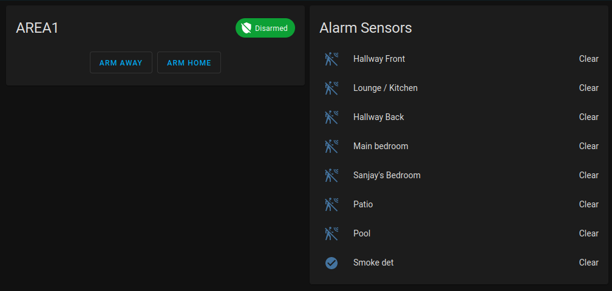

# Home assistant integration for solution 3000
This integration allows for connecting home assistant to a solution 2000 or 3000 panel.
It is based on a combination of the [vera integration](https://drive.google.com/file/d/1kbwVQMPxxul9jySapcCZM9C5rQPPKN4k/view) and https://github.com/EHylands/homebridge-boschcontrolpanel_bgseries.

Do note that using this integration will stop both A-Link and the RSC+ app from working, as the panel only accepts connections from one source at a time.

## Configuration
You will need the ip, port, automation password and the installer code for your module

The automation password can be found via A-Link. It will be under the config via the "Comm\Network Config\A-Link/RSC Password" option under A-Link, and the installer code is found under "Access\Installer Code" option.

The default port is 7700

The default installer code is 1234, but this will likley have been changed by your installer

The default automation password is 0000000000



Note that the alarm does not not have an ability to let home assistant know what type of sensor is in use. If you have a sensor plugged in that isnt a PIR sensor (for example, a smoke alarm) and you want this to show up in home assistant, edit the entity in customize.yaml. For example:
```yaml
binary_sensor.1_8:
  device_class: smoke
```
A list of all device classes can be found in the [home assistant binary sensor documentation](https://www.home-assistant.io/integrations/binary_sensor/)

Note that if you get an "Invalid App Passcode" error, this means that the panel has refused authentication. This can happen if another connection is active to the panel, such as a A-Link or RSC+ app being connected to the panel. 